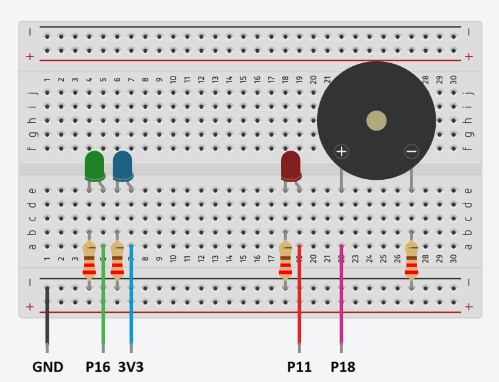

# Buffer Overflow Attack: Privilege Escalation

*Operating Systems for Embedded Systems A.Y. 2022/23 group project: a Priviledge Escalation demonstration exploiting Buffer Overflow.*

## What is a Buffer Overflow

Buffer overflow attacks stand as a pervasive threat in cybersecurity, exploiting vulnerabilities within programs to manipulate their memory and compromise system integrity. This class of attacks is particularly notorious for its potential to facilitate privilege escalation, allowing attackers to gain unauthorized access and control over a system.

In the demonstration found in this repository, we delve into the intricacies of a buffer overflow attack with a focus on privilege escalation. The target program for our demonstration, `morsecode`, serves as the focal point for our exploration. This vulnerable program is intentionally crafted to showcase the impact of disabling key security protections and using obsolete vulnerable functions.

In the following example, three critical protections have been deliberately disabled:

1. **Stack Smash Protector (SSP, Stack Canary):** Disabled for Part 1 and Part 2. When building the vulnerable code, the Stack Smash Protector is turned off using the following compilation command:

   ```bash
   $ gcc -fno-stack-protector [other args] morsecode.c
   ```

2. **Non-executable Stack (Data Execution Prevention, DEP):** Disabled for Part 1. The binary `morsecode` is marked as requiring an executable stack:

   ```bash
   $ execstack -s ./morsecode
   ```

   Please note that the effectiveness of `execstack -c ./morsecode` may vary based on the platform.

3. **Address Space Layout Randomization (ASLR):** Disabled for Part 1 and Part 2. ASLR is turned off for the vulnerable binary during execution:

   ```bash
   $ setarch $(arch) -R ./morsecode
   ```

These deliberate adjustments aim to create a controlled environment for educational purposes, emphasizing the importance of understanding and mitigating buffer overflow vulnerabilities to fortify system security. The subsequent sections will guide you through the practical steps of a buffer overflow attack, focusing on both the attack process and the significance of safeguarding against such exploits.

## Attack Demo

### Scenario

Imagine a scenario where a victim hosts a service, implemented as the `morsecode` function, accessible from the external network via netcat (nc). An attacker gains access to the source code (`morsecode.c`) and utilizes gdb to identify the return address corresponding to the beginning of the array. The attacker then crafts a payload using `makepayload.sh` based on the obtained return address.

Upon connecting to the victim's hosted service with netcat, the attacker injects the prepared payload, ultimately spawning a shell with the same level of access as the victim (sudo). Subsequently, the attacker can perform unauthorized actions on the target system.

### Attack Steps

#### Board Connection Layout

The demonstration is implemented on a Raspberry Pi 3B (ARM Cortex A53 Processor) running Raspbian Linux. The board is connected as shown in the schematic below with some LEDs and a Piezo Buzzer driven by `morsecode`, in order to display the message translated in morsecode to the outside world.



#### Victim's Machine

The `src/startup.sh` script allows the system to automatically run the program and link it with netcat on the network. This script can also be autonomously launched at boot time by creating a systemctl service like we did for our machine.

In alternative, the manual steps are:

1. Change to the `src` directory:

   ```bash
   $ cd src
   ```

2. On one terminal, create a named pipe and listen for incoming data on port 8000:

   ```bash
   $ mkfifo pip
   $ nc -l 8000 > pip
   ```

3. On another terminal, execute the morsecode program, redirecting input from the named pipe:

   ```bash
   cat pip | setarch `arch` -R ./morsecode
   ```

#### Attacker's Machine

1. Discover the return address using gdb, or simply look at the printed value at the start of the program.
2. Generate the payload based on the corresponding return address using `makepayload.sh`.
3. Inject the payload into the victim's service by connecting to it with netcat ($IP is the local IP of the Victim's Machine):
   ```bash
   $ (cat ./out/payload.bin; cat) | nc $IP 8000
   ```

Verify the successful injection by checking the spawned shell on the victim's machine.

## Credits

Group n.03:

- Marco Chiarle
- Lorenzo Ruotolo
- Giovanni Santangelo
- Alessandro Vargiu

Shield: [![CC BY-NC-SA 4.0][cc-by-nc-sa-shield]][cc-by-nc-sa]

This work is licensed under a
[Creative Commons Attribution-NonCommercial-ShareAlike 4.0 International License][cc-by-nc-sa].

[![CC BY-NC-SA 4.0][cc-by-nc-sa-image]][cc-by-nc-sa]

[cc-by-nc-sa]: http://creativecommons.org/licenses/by-nc-sa/4.0/
[cc-by-nc-sa-image]: https://licensebuttons.net/l/by-nc-sa/4.0/88x31.png
[cc-by-nc-sa-shield]: https://img.shields.io/badge/License-CC%20BY--NC--SA%204.0-lightgrey.svg
